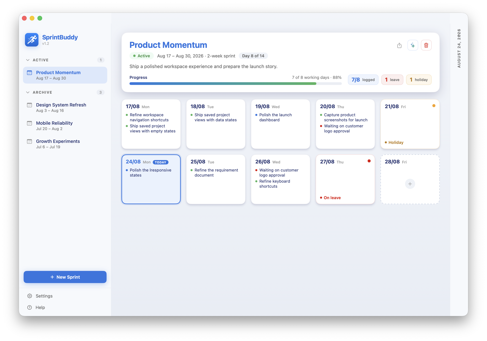
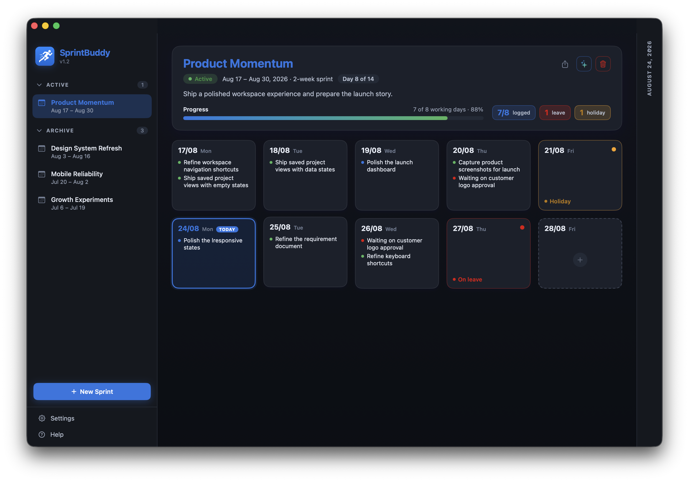
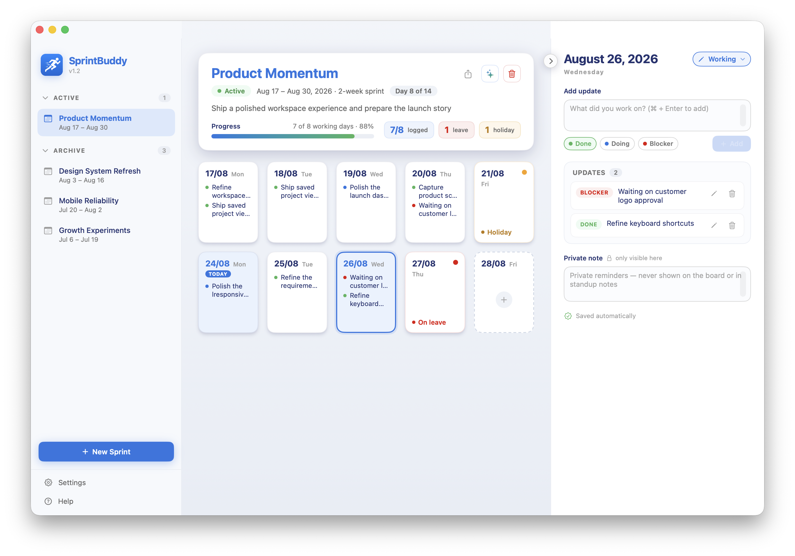
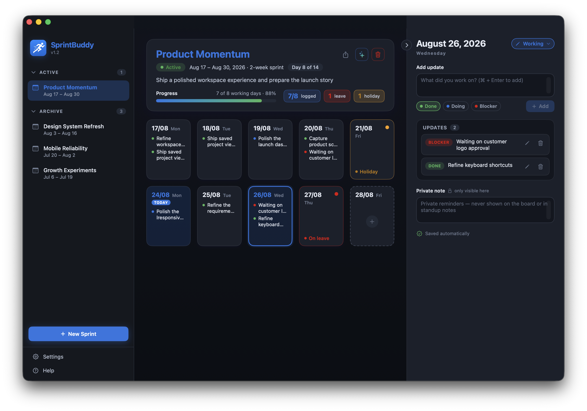
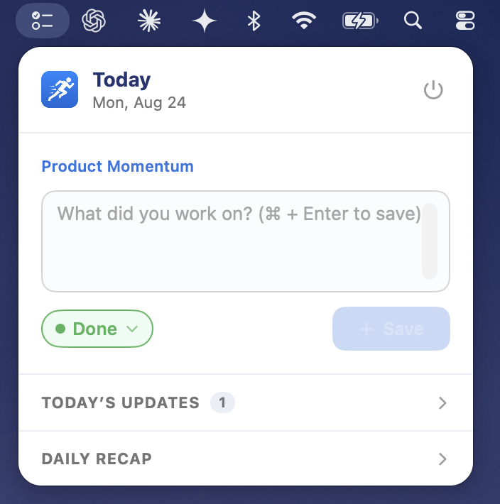
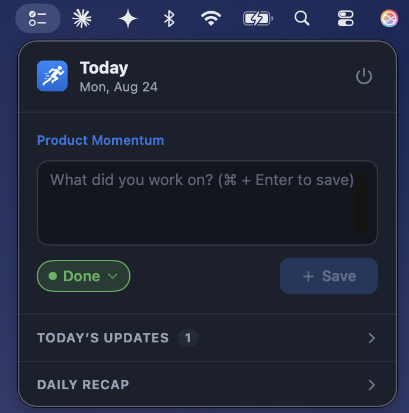

# SprintBuddy

A native macOS app for logging your daily sprint effort. Create a sprint,
get a card for every day, and jot what you worked on — tagged **Done**,
**Doing**, or **Blocker** — then export tidy standup notes when you need them.

Built with SwiftUI + SwiftData for macOS.

## Features

- **Sprint board** — create a sprint of any length (1–4 weeks) and get a
  day card for every day, with weekends marked automatically.
- **Daily updates** — log what you worked on per day, tagged Done / Doing /
  Blocker, with inline edit and delete.
- **Day statuses** — mark a day as Working, Leave, Holiday, or Weekend;
  leave/holiday days are excluded from working-day totals.
- **Private notes** — per-day reminders that never appear on the board or in
  exports.
- **Progress at a glance** — logged / working-day count, progress bar, and
  leave/holiday tallies in the sprint overview.
- **Standup notes** — one-click formatted summary of the sprint, ready to
  copy into your standup.
- **JSON export / import** — back up or move your data; imports validate the
  file and confirm before replacing existing data.
- **Menu-bar quick logger** — a menu-bar panel to log today's update without
  opening the main window; stays available even when the window is closed.
- **Launch at login** — optional, via macOS `SMAppService`.
- **Light / dark / auto** appearance, plus "show weekends" and "flag
  unlogged days" view options.

## Preview

SprintBuddy is designed to feel at home in macOS, with a carefully matched
light and dark appearance throughout the board, detail drawer, and quick
logger.

### Sprint board

| Light | Dark |
| :---: | :---: |
|  |  |

### Detail drawer

| Light | Dark |
| :---: | :---: |
|  |  |

### Menu-bar quick logger

| Light | Dark |
| :---: | :---: |
|  |  |

## Download

Download the latest version from the [Releases page](https://github.com/hadiyarajesh/sprintbuddy/releases/).

## Requirements

- macOS 14 (Sonoma) or later
- Xcode 16 or later (Swift 5)

> On-device sprint summaries additionally require macOS 26 and Apple
> Intelligence. All other features work on macOS 14 and later.

## Build & run

Open `SprintBuddy.xcodeproj` in Xcode and run the **SprintBuddy** scheme, or
from the command line:

```bash
xcodebuild -project SprintBuddy.xcodeproj -scheme SprintBuddy \
  -destination 'platform=macOS' build
```

## Architecture

- **Native interface** — SwiftUI provides a focused, responsive macOS
  experience for planning sprints and reviewing progress.
- **Local data** — SwiftData keeps your sprints and daily updates on your Mac,
  making the app fast, private, and available offline.
- **Core logic** — small, deterministic Swift types power progress tracking,
  standup generation, and import/export, keeping those features reliable and
  easy to evolve.
- **Menu-bar companion** — a lightweight quick logger shares the same data so
  you can capture an update without opening the main window.

## Tests

Core behavior is covered by lightweight tests for dates, sprint calculations,
standup formatting, and import/export. The tests focus on the app's rules,
keeping them fast to run and independent of the macOS interface.

## Contribution

Contributions are welcome. Please open an issue for bugs or feature ideas, or
submit a pull request with a clear description of your change.

## License

Released under the [MIT License](LICENSE).
